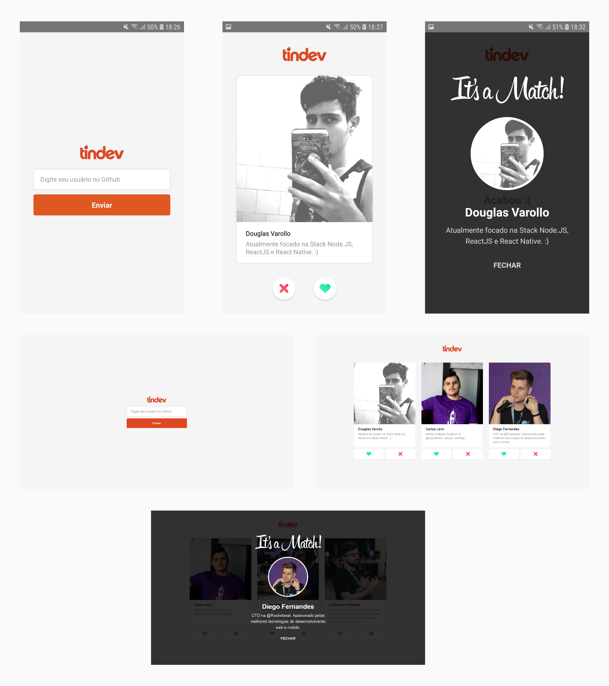

<h1 align="center">Semana Omnistack 8</h1>

Projeto desenvolvido na semana OmniStack 8.0 da Rocketseat.

## Sobre o projeto

A ideia do projeto é construir um "Tinder" para desenvolvedores.

## Funcionalidades

- Criação de um desenvolvedor usando o usuário do Github
- Listar todos os desenvolvedores
- Poder dar like/dislike em um desenvolvedor
- Quando dois desenvolvedores derem likes acontece o Match

  

## Backend

Para executar o backend siga as instruções do arquivo [README.md](https://github.com/DouglasVarollo/OmniStack8/blob/master/backend/README.md) que está na pasta backend.

## Frontend

Para executar o frontend siga as instruções do arquivo [README.md](https://github.com/DouglasVarollo/OmniStack8/blob/master/frontend/README.md) que está na pasta frontend.

## Mobile

Para executar o mobile siga as instruções do arquivo [README.md](https://github.com/DouglasVarollo/OmniStack8/blob/master/mobile/README.md) que está na pasta mobile.

